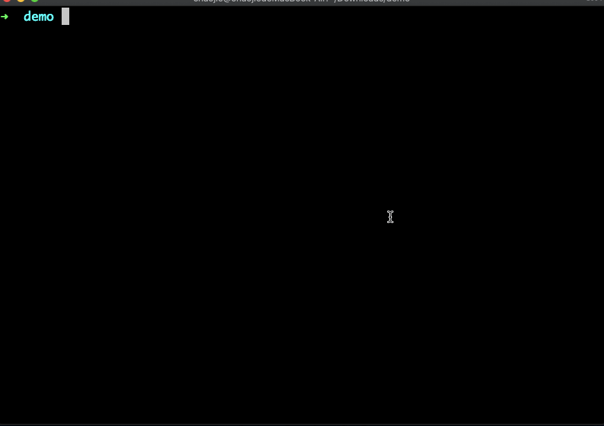

<div align="center">
<h1>ITARO</h1>

<p>itaro 按需编译解决方案，从此告别改 1 行代码，编译半分钟的情况。</p>
</div>

## 安装

项目安装：

```bash
yarn add @dream2023/itaro -D # npm install --save-dev @dream2023/itaro
```

全局安装：

```bash
yarn global add @dream2023/itaro # npm install -g @dream2023/itaro
```

## 使用

### taro 1.x 和 2.x 使用方式

**第 1 步**：修改 `package.json`，增加 `scripts`，例如：

```json
{
  "dev:weapp": "npm run build:weapp -- --watch",
  "dev:itaro": "itaro npm run dev:weapp"
}
```

上面演示的是启动 `dev:weapp`，如果是启动 `build:h5`，可以增加 `itaro npm run build:h5`，其实就是在 `itaro` 后面跟着启动命令。

**第 2 步**：修改 `config/index.js` 的 `defineConstants` 字段为：

```js
{
  defineConstants: {
    'process.env.ITARO': process.env.ITARO
  }
}
```

**第 3 步**：修改 `app.jsx` 或者 `app.tsx`：

```jsx
// ...
class App extends Component {
  // 增加一个三元表达式
  config = process.env.ITARO
    ? process.env.ITARO
    : {
        pages: ["pages/index/index"],
        // ...
      }
}
```

### taro 3.x 使用方式

**第 1 步**：修改 `package.json`，增加 `scripts`，例如：

> 同 1.x 和 2.x。

```json
{
  "dev:weapp": "npm run build:weapp -- --watch",
  "dev:itaro": "itaro npm run dev:weapp"
}
```

上面演示的是启动 `dev:weapp`，如果是启动 `build:h5`，可以增加 `itaro npm run build:h5`，其实就是在 `itaro` 后面跟着启动命令。

**第 2 步**：修改 `app.config.js` 或者 `app.config.ts` 为：

```js
import itaro from "@dream2023/itaro"

export default itaro({
  pages: ["pages/index/index"],
  // ...
})
```

## 特别说明

- `subpackages` 页面，如果选择了 `root` 页面，则会自动选择全部子页面；
- `tabBar` 中的页面会被自动选中，不会出现在选择列中；
- `preloadRule` 字段会被删除；
- `itaro` 会缓存用户的选择，所以当第二次启动时，会提示是否沿用之前的选择；
- 缓存是持久化文件存储的，所以一旦改变 `app` 的配置项（比如修改了 tabbar 或者新增了页面），再次启动时，需要重新选择来更新缓存！！！
